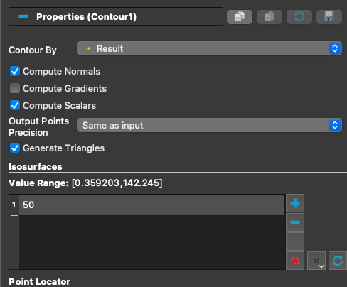
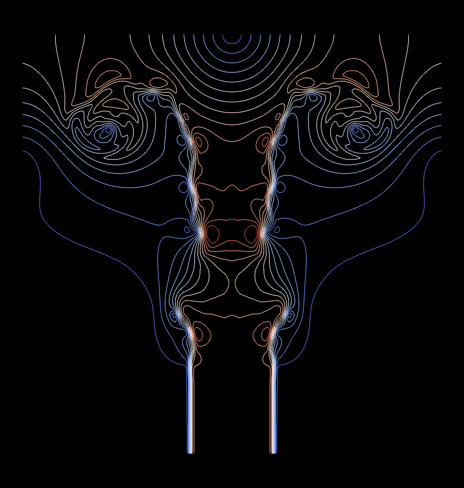

# Contours
Contours (and isosurfaces) can be very useful in scientific visualization.
To create contours in Paraview, you must first have point data.
The `Cell Data to Point Data` filter must be applied if your data is cell data.
After this, a `Contour` filter can be applied.
The basic properties of a contour figure are shown below.

- Contour by is the variable contours will be taken over
- Isosurfaces is the list of values for which contours will be made.
You can add and remove contour values using the plus and minus buttons.
Also, note that the value range can help select contour values.

## Useful Settings

- Opacity: Make the contours slightly see-through.
This can be useful if you want to show the contours of one variable over a 2D image of another variable.

- Line Width: Paraview's default linewidth of 1 pixel often needs to be thicker.
Increasing this makes your lines easier to see.

- Render Lines as Tubes: This renders lines as tubes and can make contours look better in 3D.

## Example
The following is an image of contours of velocity magnitude for a jet impinging a solid wall.

