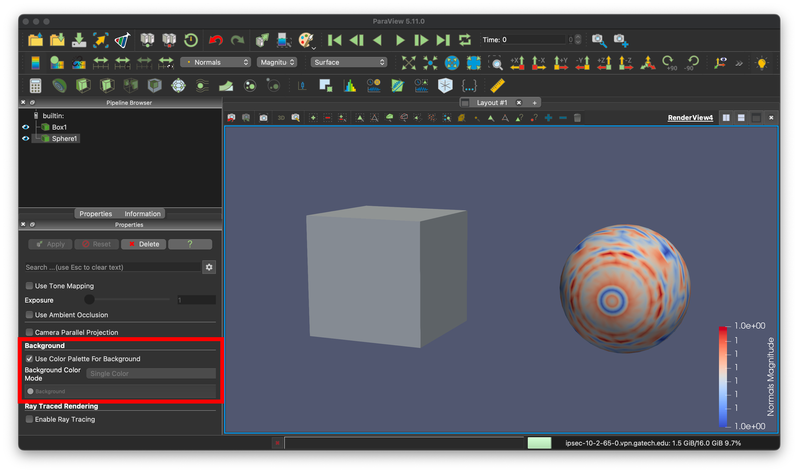
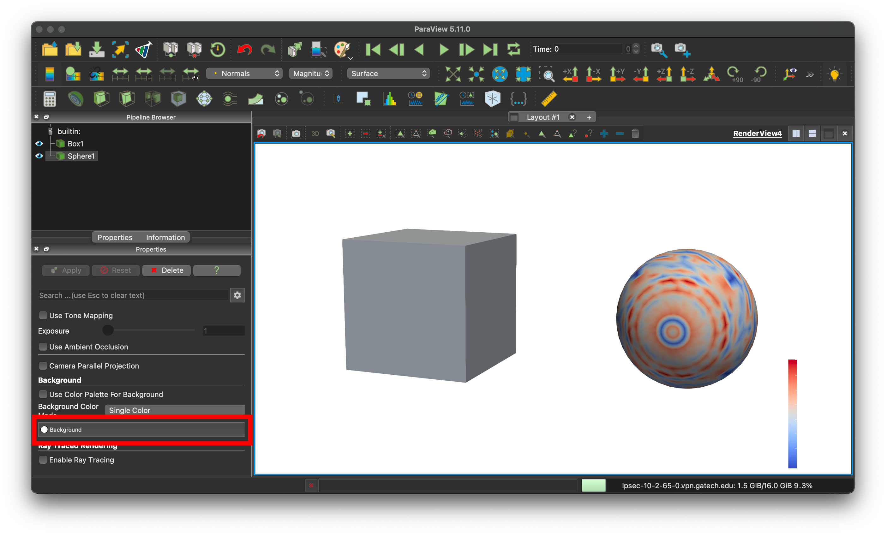
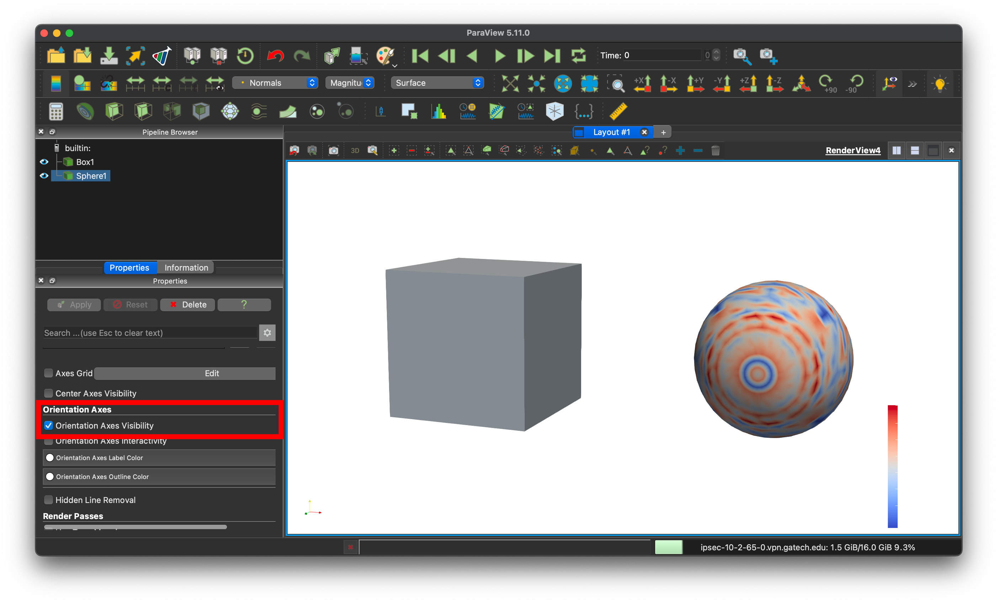
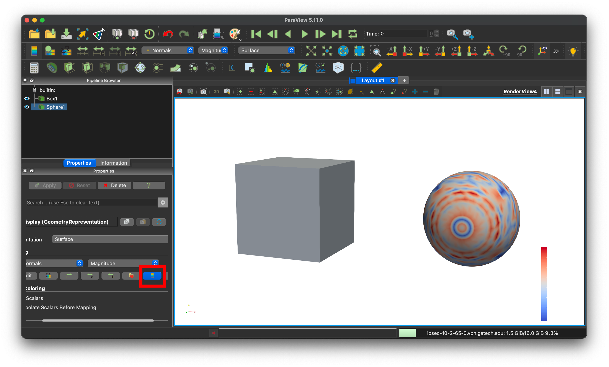
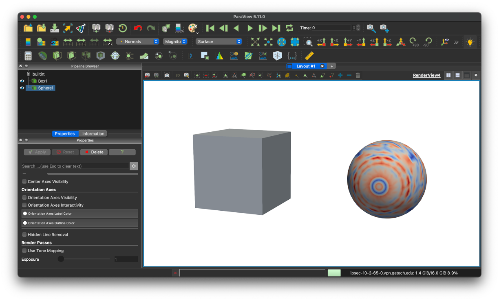

# Three Steps to Nice Visualization
Advanced features like opacity mapping, ray tracing, and volume rendering can all be used to make nice renderings of scientific data.
However, there are three simple things you can do to turn the default settings in Paraview into visualizations that are nice enough to share with the outside world.
This short set of tips will show you how to do this and get you started on making nice visualizations of scientific data.
To follow along with this tutorial, start by opening the Paraview state file `Resources/cubeAndSphere.pvsm` in the most recent version of Paraview.

## Change the default background color
Paraview's default background color is instantly recognizeable to anyone who uses the software regularly.
While there's nothing wrong with the default background color, changing it can indicate to others that you've put time and effort into making nice visualizations, and will often look better.
For all but a small subset of visualizations, a black or white background will look much nicer than the default gray background.
To change the background color, scroll to the bottom of the properties tab and unselect Use Color Palette for Background shown below.

This will automatically change the background color to white.
To select a color other than white, click the background dropdown shown below and use the resulting popup window to select your desired color.

## Remove the orientation axis
The orientation axis is shown by default in the lower left hand corner of the reder view.
In many cases, it is not relevant to visualization and can be removed.
To do this, unselect Orientation Axis Visibility in the properties tab as shown below.

## Remove the colorbar
Knowing the values of the color bar is not always pertinent to scientific visualization.
If this is the case, it can be removed, yielding a cleaner visulation.
This can be done by changing the visibility toggle in the properties tab as shown below.

Note that each visible item in the pipeline broswer can have its color bar toggled on or off individually.
The render view after make these three changes is shown below.
